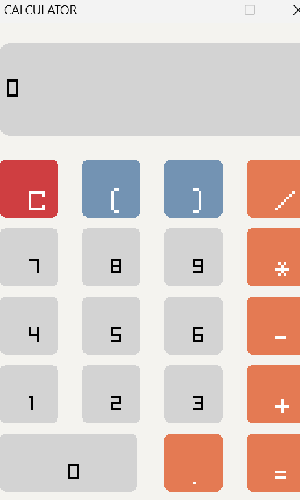

# Simple Calculator

This is a simple calculator made in c++ using raylib, although raylib is a game library, i used it to create a calculator.

## Features
    1. Fully functioning
    2. supports addition
    3. supports subtraction
    4. supports multiplication
    5. supports division
    6. handles errors also
    7. user friendly 
## How to Use?
    1. Download the repositary zip by clicking on '<> code' icon in repositary.
    2. After unzipping the file, you will find main.exe, run main.exe file.
    3. Window protection menu will pop up, click on 'more info', then 'run anyway'.
## Screenshots

